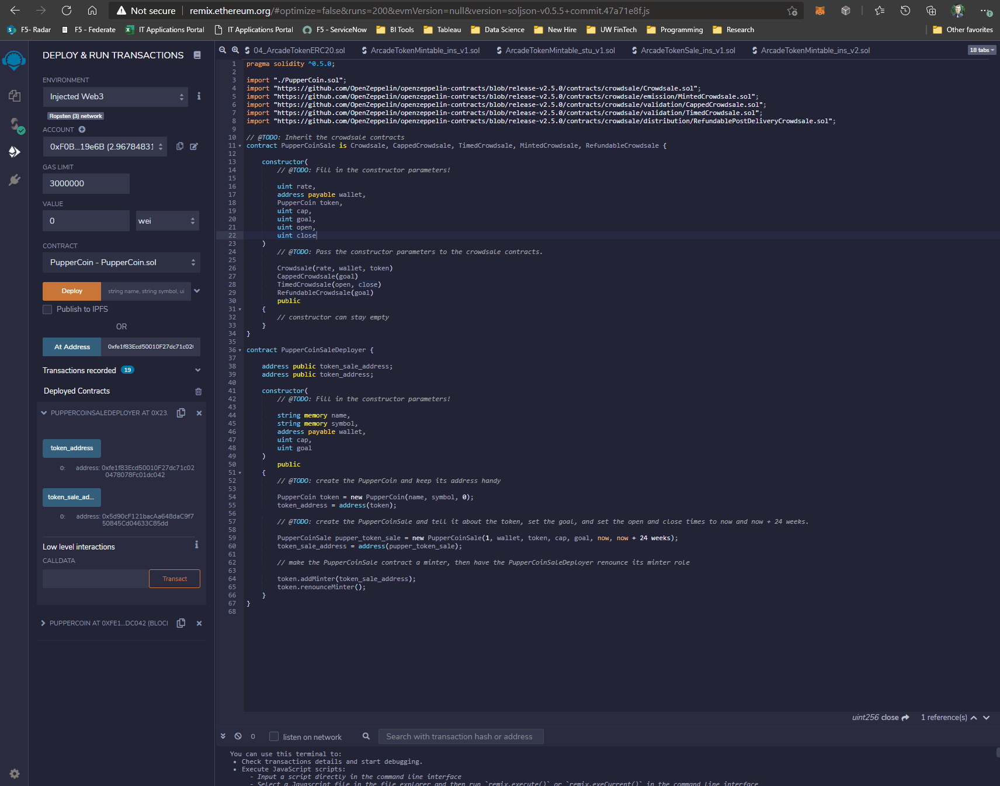
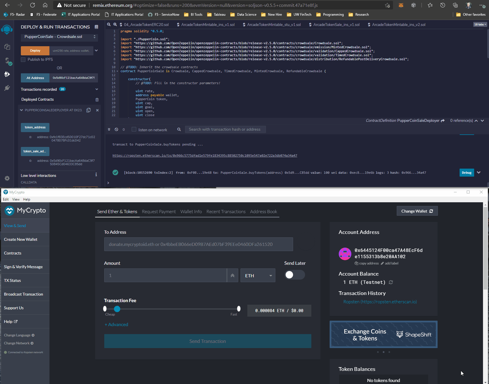
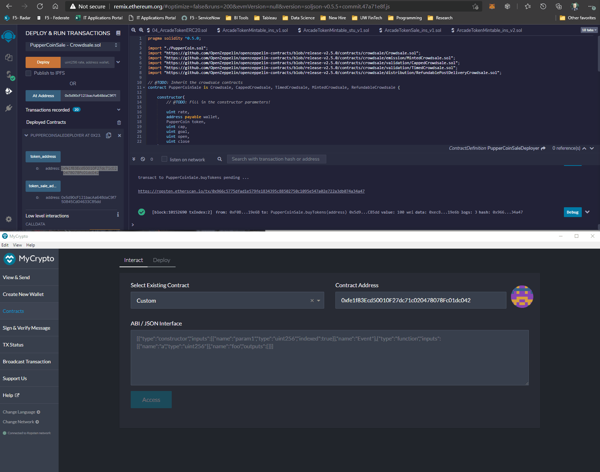

# Advanced Solidity - UW FinTech Homework
___

Leveraging Remix as the IDE to develop in Solidity, and ERC20Mintable as the standard for creating tokens on the Ethereum Ropsten testnet. In the guided sessions below, PupperCoin was created, deployed and bought using wallets hosted in Ganache to walk-through a token crowdsale motion. MyCrypto was also leveraged to test, but was unsuccessful in having the transaction complete as captured below.

[**Ropsten Transaction Confirmation**](https://ropsten.etherscan.io/tx/0x966c5775dfad1e579fe1834395c88502750c1095e547a02e722a3db074a34a47)

## PupperCoin Deployment
___

## buyToken transaction using MetaMask

## Adding PupperCoin to MyCrypto wallet tokens

## buyToken transaction tested (failed) in MyCrypto 

